#   Divide of Everything Website Project 2018

*   [Strategy Plane](#strategy)
    *   [Define roles and responsibilities](#randr)
    *   [Project Charter](#charter)
    *   [Website development Roadmap](#roadmap)
    *   [Strategy Trade-off](#trade)
*   [Scope Plane](#scope)
    *   [Scenarios](#scenarios)
    *   [Functional Specifications](#func)
    *   [Content Requirements](#content)
        *   [SiteMap](#sitemap)
        *   [Navigation systems](#nav)
*   [Structure & Skeleton Plane](#sands)
    *   [Interaction design](#design)
    *   [Information architecture](#architecture)
*   [Wireframes](#wireframes)
    *   Index - Home Page
    *   About Us Page
    *   Catalogue Page
    *   News Page
    *   Booking Enquiry
*   [Surface Plane](#surface)
    *   [Development Phase](#dev)
        *   [IDE](#ide)
        *   [Version Control](#version)
        *   [Readme](#readme)
        *   [Testing](#testing)
            *   Book us
            *   News
            *   Catalogue
            *   About us
            *   Home
        *   [Basice HTML Structure](#html)
            *   Header
            *   Footer
        *   [Style](#style)
            *   Typography
            *   Colours
*  [External Help](#external)

##  Strategy Plane
Our goal at this stage of the project is to identify what the customer aims to achieve, what their business goals are, and in turn, the reason for a website.

The scope is fundamentally determined by the strategy of the site, so it is important we define a good strategy from the outset. This strategy incorporates not only the benefit to the owners of the site but also the benefit to the users.

We aim to:
*   determine the business objectives and the value of the website
*   use this plane to determine the reason for the websites existence

### Define roles and responsibilities
From here on **Divide of Everything** will be known as the client.

For the purposes of this project, Sonya Cooley will have full authority, primary responsibility, and full accountability for all aspects of the project. 
She will have a Mentor available to her at the beginning, middle and end of the project.

### Project Charter
|Purpose: What purpose does the website serve?|The client website will target fans and potential fans with their back catalogue and new material.  The site will showcase their music and publicise their availability to perform at events, etc.|
|:---|:---|
|**Goals:** What outcomes does it need to achieve?|<ul><li>Share new music and their back catalogue with fans and potential fans. Keeping old fans happy and attracting new fans</li><li>Showcase their music</li><li>Publicise their availability to perform at events, parties, etc</li><li>Push their social media presence</li></ul>
|**Target audience:** Whom must the product appeal to and work for?|Past fans, current fans, and potential fans.|
|**Success indicators:** How will you know you have achieved project goals?|Many successful bookings via website|
|**Strategies:** What approaches will help to realize the goals?|<ul><li>We will take a mobile first approach to Content.</li><li>We will not forget the target audience</li><li>Simplicity is a must.</li></ul>
|**Tactics:** What activities might help to realise the strategies?|<ul><li>Provide a user experience that is accessible and enjoyable for all visitors</li><ul><li>following conventions for design and interaction</li><li>providing clear and consistent navigation</li><li>testing usability with a wide range of users, including people with disabilities and older adults</li></ul></ul>

### Website development Roadmap
The UXD will be driven by business goals and user needs.

|**Define**|Customer analysis, Requirements gathering, SEO, Social Media, Content Strategy – Personas, Content inventory.|
|:---|:---|
|**Design**|Information architecture, Functional & technical requirements, Navigation design, Wireframes, UX/UI, Pages, Branding, style guides, mock-ups.|
|**Develop**|Look & feel, Design and Development, Build, Version control, Testing, Deploy|

### Strategy Trade-off
|Opportunity/Problem|Importance|Viability/Feasibility|
|:---|:---|:---|
|Create Online Presence|5|5|
|Increase fan numbers|4|4|
|Showcase music|4|5|
|Increase bookings|	4|4|
|Complete catalogue online|2|1|

|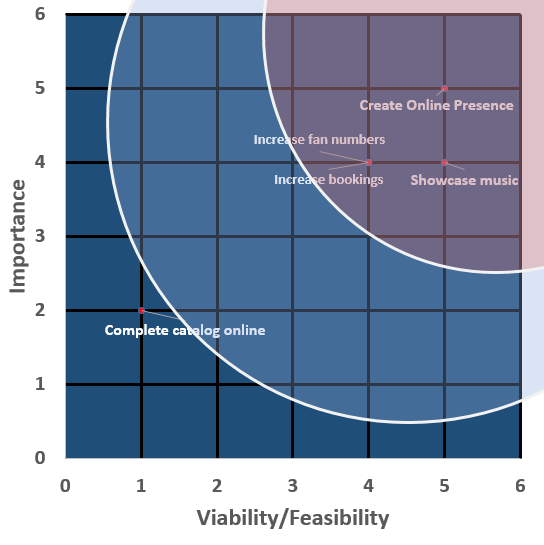|Feasible for initial release <ul><li>Create Online Presence</li><li>Increase fan numbers</li><li>Showcase music</li><li>Increase bookings</li></ul>Features for future releases<ul><li>Complete catalogue online</li></ul>
|:---|:---|

##  Scope Plane
Based on our Strategy above, we will create a project scope. We will;
*   determine the websites requirements
*   determine the websites key functionality
*   determine what features are to be included in this and possible future product releases

The client website will target fans and potential fans with their back catalogue and new material. The site will showcase their music and publicise their availability to perform at events, etc.

### Scenarios
####    Client Fan:
A client fan will be a fan who is aware of the client for some time. They will be aware of the clients back catalogue of music and keep up to date with their new music.
A client fan will visit the site to listen to the clients back catalogue, read client news and lookup where and when future gigs will happen. A client fan may also wish to make an enquiry about booking the band for an event as they are aware of the type of gig the client performs.

####    New Client Fan:
A new client fan will visit the site to listen to new music that may have caught their attention. They will then listen to the clients back catalogue. A new client will be interested in the About Us content and will also be interested in where and when future gigs will happen.

####    Business User:
A business user may be aware of the client from corporate events or other business events. The business user is aware that the client attracts large audiences and has a good catalogue of music.
The business user will visit the site to look up when/where the clients next performances are and if the client is available, they will make an enquiry about booking the client via the booking enquiry form.

###    Functional Specifications
The site will provide users with access to the clients’ music catalogue and the ability to make an enquiry about booking the client for events.
The site will provide the ability to;
*   navigate between pages
*   listen to the clients’ catalogue of music and 
*   make an enquiry about booking the client for events.

The site will be optimised for latest version of Chrome, Firefox, Internet Explorer, Safari and Opera. And optimised for mobile usage. HTML and CSS will be written using the Mobile-First approach. The mobile-first approach is designing for the smallest screen and working your way up to desktop.

###    Content Requirements
Most screens/pages will follow a standard format, with a look and feel to be designed by a graphic designer. Each page will have a content area between a consistent header and footer.
The header will contain the client logo and navigation. 
The footer will contain links to the client’s social media sites.
  
All pages will be created using HTML5 and CSS3, provided by the Bootstrap framework 4.
Content for these pages will be provided by the client.

####   SiteMap
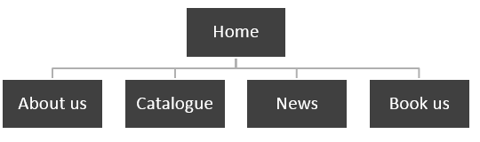

|Home Page|The home page will consist of a hero image, a header containing a logo and navigation and a footer with links to other social media sites. The navigation will take users to other site pages while the logo will also be a link taking the user to the home page.|
|:---|:---|
|About us|The about us page will contain information about the client and a brief profile on each of the band members.|
|Online catalogue|This page provides access to the clients’ music catalogue which is available on soundcloud. Music and videos will either be linked to or embedded on the page.|
|News|Providing information to users about client news and upcoming gigs|
|Book us|Provides the ability to make an enquiry about booking the client using a web form|

####  Navigation systems
|Description|Response|
|:---|:---|
|About us|Takes user to about us page|
|Catalogue|Takes user to music catalogue page|
|News|Takes user to news and gigs page|
|Book us|Takes user to booking enquiry form|
|Logo|Takes user to home page|

##  Structure & Skeleton Plane
Our goal for the Structure plane is to organise the information architecture and interactions for the site. We will keep a consistent, predictable, learnable interface, and, interactions. We will use industry standard technologies to implement expected behaviours when using the site, e.g. tooltips, navigation, including accessibility, etc.

Users will find the navigation at the top of the site in an expected location. The site will be intuitive and follow tried and trusted paths.

Our forms will follow user expectations where feedback is provided if user interactions are unexpected, incomplete or complete.

### Interaction design
The website will use a weblike organisational structure which will pose few restrictions on the pattern of information used. This structure works best for small sites. The user will be presented with a consistent navigation along the top of every page. Each navigation element will take the user to the same page e.g. ‘About us’ will take the user to the ‘About Us’ page regardless of what page the user is currently on.

The navigation will follow this order:
**About us – Catalogue – News – Book Us** and the logo will also act as a link to the home page (index.html)

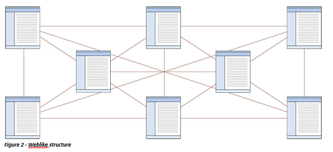

### Information architecture
The website will implement content in a standard tree structure. It will go to one level which will reduce complexity and ensure users do not have to exceed the three-click rule of thumb.

|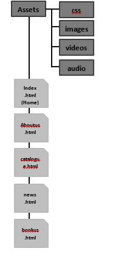|At the root of the site:<ul><li>Index.html</li><li>Aboutus.html</li><li>Catalogue.html</li><li>News.html</li><li>Bookus.html</li></ul>Assets Directory<ul><li>CSS Directory</li><li>Images Directory</li><li>ideos Directory</li><li>Audio Directory</li></ul>|
|:---|:---|

##  Wireframes
### Index Home Page
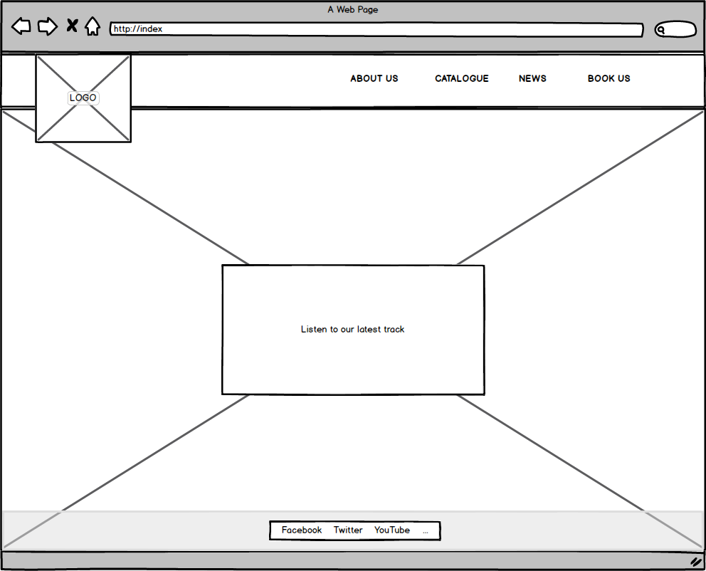
### About Us Page
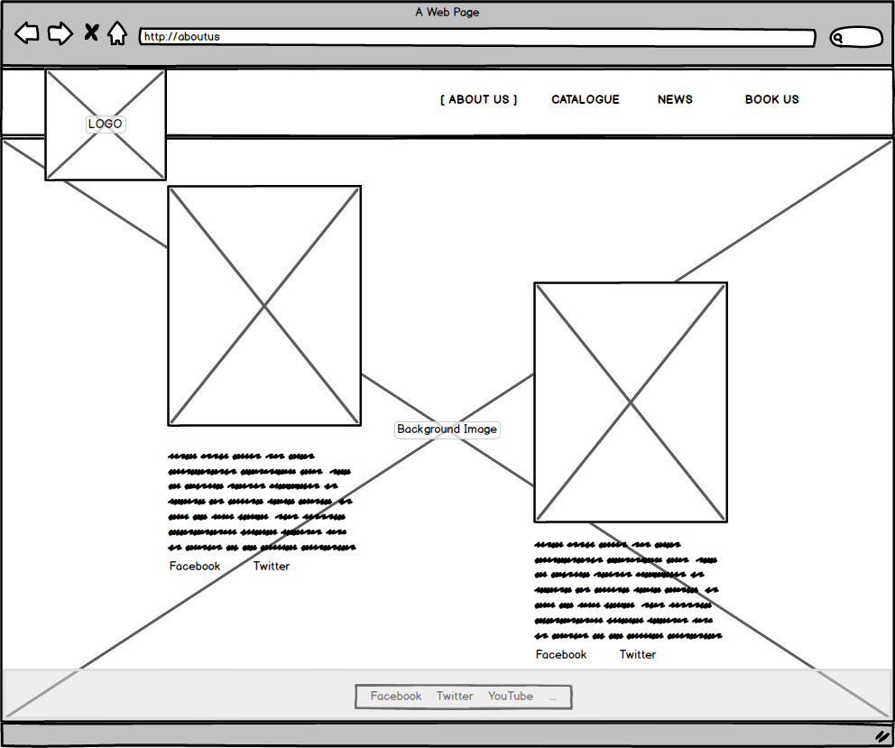
### catalogue Page
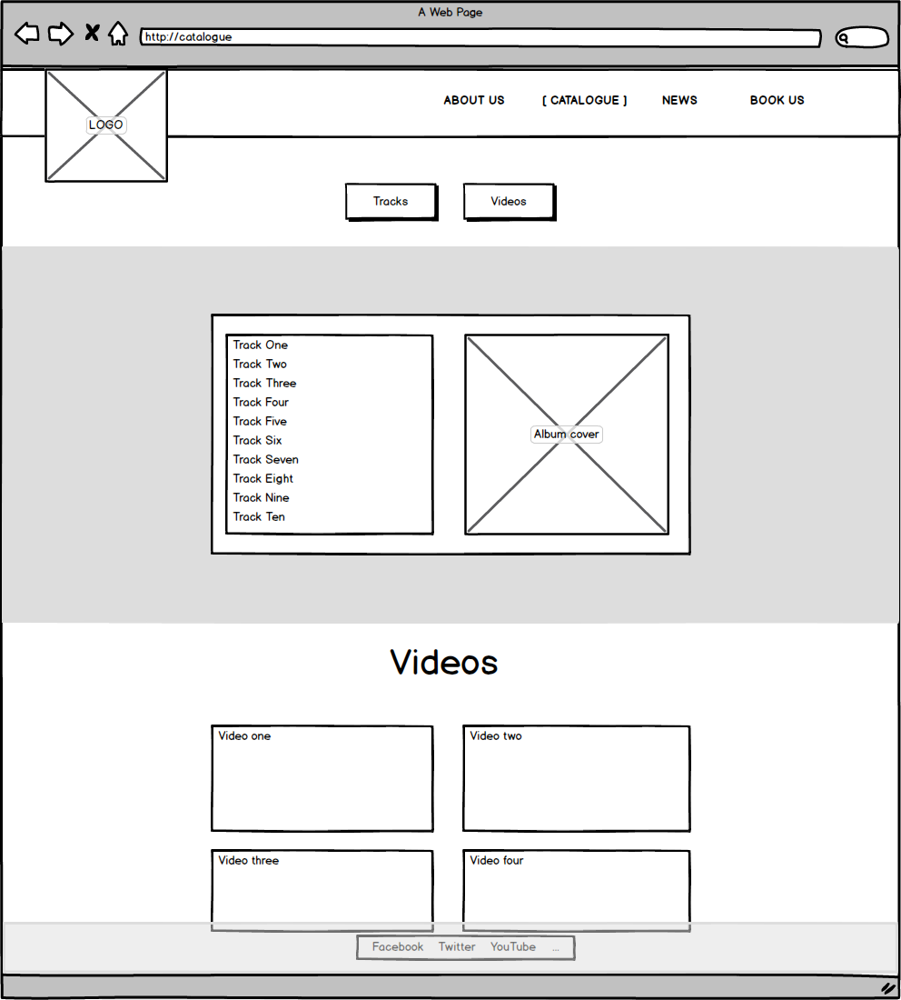
### News Page
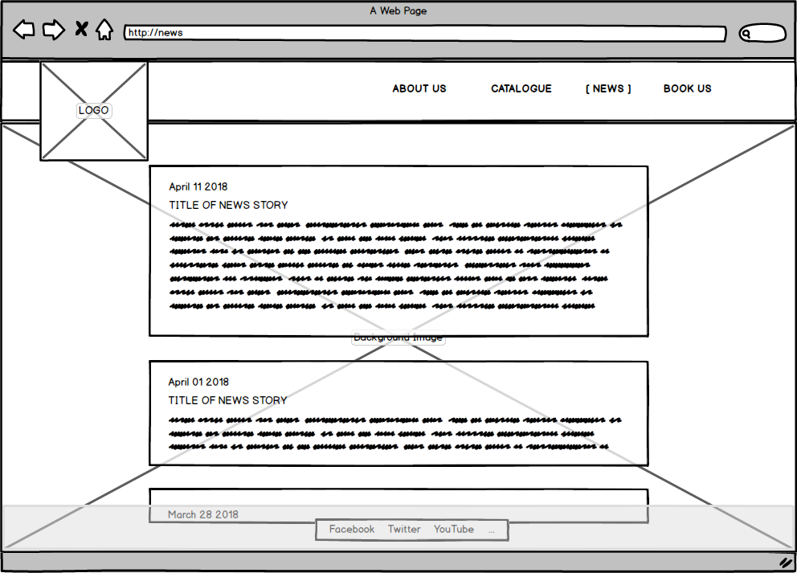
### Booking Enquiry Page
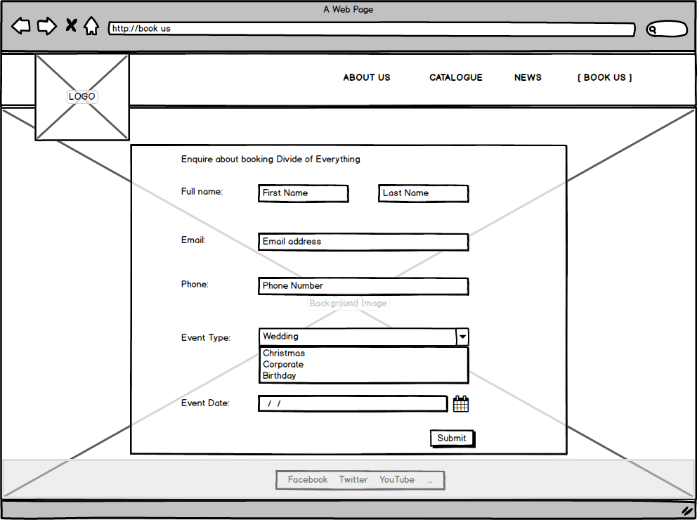

##  Surface Plane

### Development Phase

####    IDE
The website was developed using the Cloud9 IDE. 

Cloud9 IDE is an online integrated development environment, that supports hundreds of programming languages. It enables developers to get started with coding immediately with pre-configured workspaces, collaborate with their peers with collaborative coding features, and web development features like live preview and browser compatibility testing.

####    Version Control
Git was used to manage the source code for this project. Git is a version control system for tracking changes in project files.

Project files were committed to Git after each major functional addition, update or test.

####    Readme
Write a README.md file for your project that explains what the project does and the need that it fulfills. It should also describe the functionality of the project, as well as the technologies used. Detail how the project was deployed and tested and if some of the work was based on other code, explain what was kept and how it was changed to fit your need. A project submitted without a README.md file will FAIL.

####    Testing
The website was tested on an ongoing basis. Chrome and Chrome Developer Tools were the primary browser and tool used for testing. However, the site was also tested using Firefox and Internet Explorer.

HTML was validated using the Markup Validation Service provided by The World Wide Web Consortium (W3C): https://validator.w3.org/

CSS was validated using the CSS Validation Service provided by The World Wide Web Consortium (W3C): https://jigsaw.w3.org/css-validator/

During development:
*   The Body background colour had different colours for each media query to ensure the @media queries were being adapted by the browser.
*   Div’s had vibrant background colours so that the developer was easily able to identify them
*   Each change was viewed in a chrome browser and tested using developer tools at full width resolution and device emulators.
*   Remote debugging using Android, Windows and Dev Tools was used to test each new functionality and page.
*   Each page was audited using Chrome Dev Tools Audit functionality

####    Basic HTML Structure
#####   Header
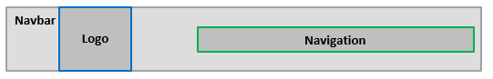

#####   Footer
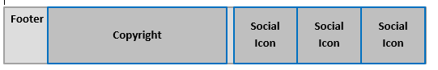

####    Style
#####   Typography
Google fonts: Raleway with sans serif as backup

#####   Colours
|#ec1e2b|rgba(236, 30, 43)|Red|
|:---|:---|:---|
|#191008|rgba(25, 16, 8)|Dark Brown|
|#ac935d|rgba(172, 147, 93)|Light Brown|

### External Help
|Stack Overflow|http://stackoverflow.com|
|:---|:---|
|How to make YouTube Videos Responsive	|https://avexdesigns.com/responsive-youtube-embed|
|CSS-Tricks	|https://css-tricks.com|
|Bootstrap Date Picker	|https://bootstrap-datepicker.readthedocs.io|

